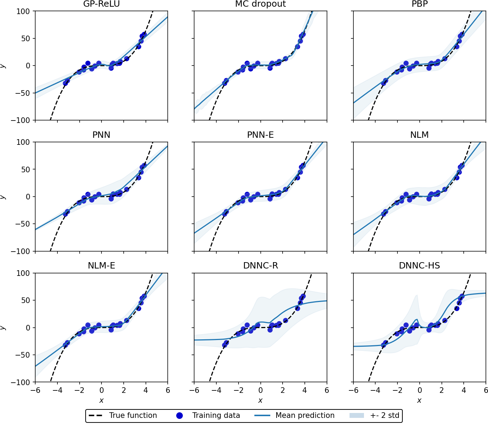
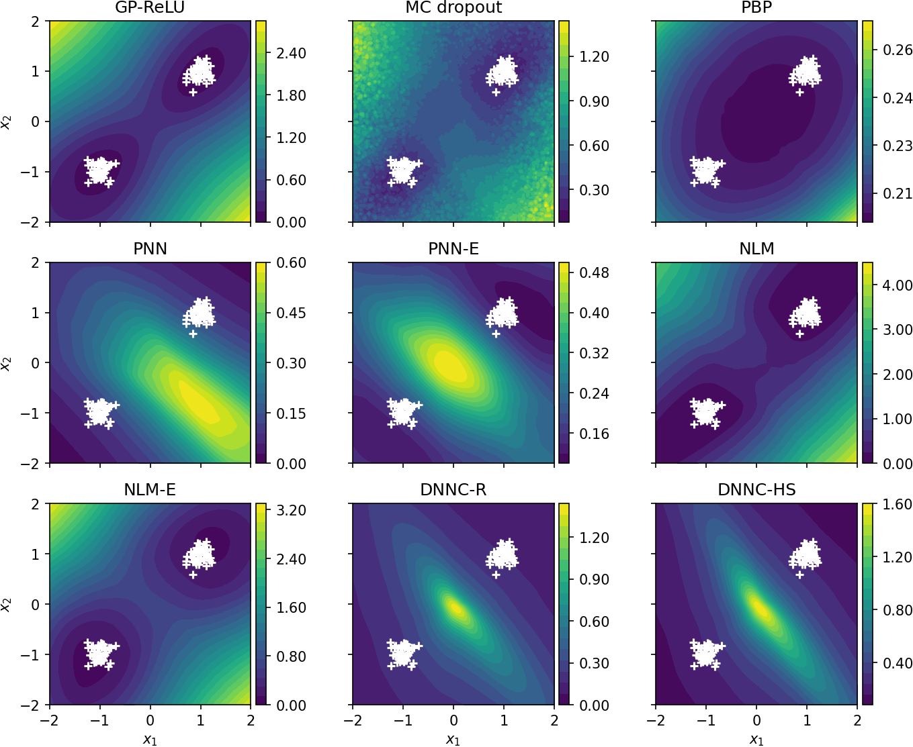

# nnuncert: Uncertainty Quantification with BNNs
Disclaimer: Code adapted or copied from other authors is marked as such at the top of the corresponding .py file or function / class.

## Abstract
<code>
Neural networks (NNs) are used to a great extent in various fields and are becoming increasingly relevant to decisions in our everyday life.
However, NNs are typically not aware of the uncertainty that accompanies their predictions, inhibiting their use in safety-critical applications.
Bayesian NNs (BNNs) allow quantifying uncertainty by modeling weights as distributions over possible values.
It is usually infeasible to compute BNNs analytically.
Various adaptations that lower the computational cost of BNNs and non-Bayesian approaches have been proposed to model uncertainty in neural networks.
As of now, there is no clear winner among those methods.
In this thesis, we benchmark the popular models Monte Carlo dropout (MC dropout), deep ensemble (PNN-E), and probabilistic backpropagation (PBP) as well as the last-layer inference methods neural linear model (NLM) and marginally calibrated deep distributional regression (DNNC), an adaption to NLM that ensures marginal calibration.
We assess their -- marginal and probabilistic -- calibration and obtain robust predictive performance results by evaluating the models' ability to predict uncertainty for in-between and out-of-range inputs.
Further, we provide empirical evidence that DNNC may be used as a post-calibration method on a NN fit with standardized inputs and outputs. This enables a wider usability of the general approach.
</code>

## Clone repo and install requirements
You can clone the repo to your local or cloud machine inside the target folder using:
```
git clone https://github.com/pjoachims/nnuncert.git
```

Next, change to the main repo folder and install all necessary packages (tested on [Google Colab](https://colab.research.google.com/)):
```bash
cd nnuncert
pip install -r requirements.txt
```
You can find a version of the packages used on that machine [here](colab_packaging.txt).

Now we can import the package in Python with:
```python
import nnuncert
```

## Implemented methods
Implemented are non-Bayesian (PNN, PNN-E) and Bayesian neural network methods that allow for quantifying uncertainty.

The methods can be initialized and run models in a convenient way (see [notebooks](notebooks) for details):
```python
from nnuncert.models import make_model

# specialize model architecture / description of hidden layers as list of tuples of 3
# [(#hidden_units, activation_function, dropout_rate), ... ]
# e.g., [[50, "relu", 0]] -> 1 hidden layer with 50 neurons without dropout
# e.g., [[50, "tang", 0.5], [50, "relu", 0.5]] -> 2 hidden layers a 50 neurons without 50% dropout with tanh / ReLU act. func
architecture = [[50, "relu", 0]]

# init model with architecture and input shape (# features)
# other model types: "DNNC-R", "PBP", "NLM", NLM-E", "PNN", "PNN-E"
input_shape = (13, ) # argument will be passed to tf.keras.Input
model = make_model("MC dropout", input_shape, architecture)

# compile and fit
model.compile(optimizer=tf.keras.optimizers.Adam(learning_rate=0.01),
              metrics=["mae", "mse"])

# fit to x_train, y_train
model.fit(x_train, y_train, epochs=40, verbose=0)

# make prediction object, which allows to get mean prediction and predictive variance
# mean: pred_test.pred_mean, variance: pred_test.var_total
# get predictive density for single input evaluated at y0 (array) : pred_test.pdfi(i=1, y0)
pred_test = model.make_prediction(x_test, npreds=1000)
```
In the table below, you find links to the implementations, the research papers, and example notebooks where the methods are applied on toy data and Boston Housing (other UCI datasets available). Note that it may take some reloads for the .ipynb due to the Github backend. All notebooks are *best run in [Google Colab](https://colab.research.google.com/) by clicking the link on top*.

You can run all models in the same notebook for [Toy 1D data](notebooks/0_toy_1d.ipynb), [Toy 2D data](notebooks/0_toy_2d.ipynb), as well as [random](notebooks/0_uci_random.ipynb), [gap](notebooks/0_uci_gap.ipynb), and [tail](notebooks/0_uci_tail.ipynb) splits of the UCI data. The calibration is assessed [here](notebooks/0_uci_calibration.ipynb).

**Note that the DNNC code cannot be run as I had to remove the code adapted from MATLAB due to licensing.**

Abbreviation | Method | Link to Implementation | Paper | Toy | Uci
--- | :-- | :-- | :-: | :-: | :-:
DNNC | Marginally Calibrated Deep Distributional Regression | [nnuncert/dnnc](nnuncert/models/dnnc) | [arxiv-link](https://arxiv.org/abs/1908.09482) | [toy.ipynb](notebooks/DNNC_toy.ipynb) | [uci.ipynb](notebooks/DNNC_uci.ipynb)
MC dropout | Monte Carlo Dropout | [nnuncert/mc_dropout](nnuncert/models/mc_dropout.py) | [arvix-link](https://arxiv.org/abs/1703.04977) | [toy.ipynb](notebooks/MC_dropout_toy.ipynb) | [uci.ipynb](notebooks/MC_dropout_uci.ipynb)
NLM | Neural Linear Model | [nnuncert/nlm](nnuncert/models/nlm.py) | [arvix-link](https://arxiv.org/abs/1912.06760) | [toy.ipynb](notebooks/NLM_toy.ipynb) | [uci.ipynb](notebooks/NLM_uci.ipynb)
NLM-E | Ensemble of NLMs | [nnuncert/ensemble](nnuncert/models/ensemble.py) | see NLM | [toy.ipynb](notebooks/NLM-E_toy.ipynb) | [uci.ipynb](notebooks/NLM-E_uci.ipynb)
PBP | Probabilistic Backpropagation | [nnuncert/pbp](nnuncert/models/pbp) | [arvix-link](https://arxiv.org/abs/1502.05336) | [toy.ipynb](notebooks/PBP_toy.ipynb) | [uci.ipynb](notebooks/PBP_uci.ipynb)
PNN | Probabilistic NN (learns mean and aleatoric variance)| [nnuncert/pnn](nnuncert/models/pnn.py) | [ieeexplore-link](https://ieeexplore.ieee.org/document/374138) | [toy.ipynb](notebooks/PNN_toy.ipynb) | [uci.ipynb](notebooks/PNN_uci.ipynb)
PNN-E | Deep Ensemble (ensemble of PNNs) | [nnuncert/ensemble](nnuncert/models/ensemble.py) | [arvix-link](https://arxiv.org/abs/1612.01474) | [toy.ipynb](notebooks/PNN-E_toy.ipynb) | [uci.ipynb](notebooks/PNN-E_uci.ipynb)

[Colab_DNNC_uci]: https://colab.research.google.com/github/nnuncert/nnuncert/blob/main/notebooks/DNNC_uci.ipynb
[Colab_MC dropout_uci]: https://colab.research.google.com/github/nnuncert/nnuncert/blob/main/notebooks/MC_dropout_uci.ipynb
[Colab_NLM_uci]: https://colab.research.google.com/github/nnuncert/nnuncert/blob/main/notebooks/NLM_uci.ipynb
[Colab_NLM-E_uci]: https://colab.research.google.com/github/nnuncert/nnuncert/blob/main/notebooks/NLM-E_uci.ipynb
[Colab_PBP_uci]: https://colab.research.google.com/github/nnuncert/nnuncert/blob/main/notebooks/PBP_uci.ipynb
[Colab_PNN_uci]: https://colab.research.google.com/github/nnuncert/nnuncert/blob/main/notebooks/PNN_uci.ipynb
[Colab_PNN-E_uci]: https://colab.research.google.com/github/nnuncert/nnuncert/blob/main/notebooks/PNN-E_uci.ipynb

[Colab_DNNC_toy]: https://colab.research.google.com/github/nnuncert/nnuncert/blob/main/notebooks/DNNC_toy.ipynb
[Colab_MC dropout_toy]: https://colab.research.google.com/github/nnuncert/nnuncert/blob/main/notebooks/MC_dropout_toy.ipynb
[Colab_NLM_toy]: https://colab.research.google.com/github/nnuncert/nnuncert/blob/main/notebooks/NLM_toy.ipynb
[Colab_NLM-E_toy]: https://colab.research.google.com/github/nnuncert/nnuncert/blob/main/notebooks/NLM-E_toy.ipynb
[Colab_PBP_toy]: https://colab.research.google.com/github/nnuncert/nnuncert/blob/main/notebooks/PBP_toy.ipynb
[Colab_PNN_toy]: https://colab.research.google.com/github/nnuncert/nnuncert/blob/main/notebooks/PNN_toy.ipynb
[Colab_PNN-E_toy]: https://colab.research.google.com/github/nnuncert/nnuncert/blob/main/notebooks/PNN-E_toy.ipynb

## Some results
DNNC-R works well *without* transforming the targets by the empirical density and instead standardizing the targets to have zero mean and unit variance suffices. See [this notebook](notebooks/0_DNNC_standard_fit.ipynb) for empirical evidence.

Note that 'MC dropout' in thesis corresponds to 'MC dropout 400', i.e., MC dropout -- after grid search for best dropout rate -- trained with epochs = 400.
Other methods are trained for 40 epochs.

### Toy datasets (click on the plot to see high resolution)
--------

| *Toy 1D* | *Toy 2D* |
| :--: | :--: |
|  |  |

### UCI datasets: predictive performance
You can find predictive boxplots for all split types: [random](results/uci/random/README.md), [gap](results/uci/gap/README.md), and [tail](results/uci/tail/README.md).

All results are saved as .json in their respective folder, e.g., PBP results on the first random split can be found [here](results/uci/random/boston/PBP/0/scores.json).  

To view individual model performance at iteration level, consult one of the following tables:

<table>
<tr><th> Random Splits </th><th> Gap Splits  </th><th> Tail Splits </th></tr>  
<tr><td>

train.csv | test.csv
--- | ---
[boston](results/uci/random/boston_train.csv) | [boston](results/uci/random/boston_test.csv)
[concrete](results/uci/random/concrete_train.csv) | [concrete](results/uci/random/concrete_test.csv)
[energy](results/uci/random/energy_train.csv) | [energy](results/uci/random/energy_test.csv)
[kin8nm](results/uci/random/kin8nm_train.csv) | [kin8nm](results/uci/random/kin8nm_test.csv)
[powerplant](results/uci/random/powerplant_train.csv) | [powerplant](results/uci/random/powerplant_test.csv)
[wine](results/uci/random/wine_train.csv) | [wine](results/uci/random/wine_test.csv)
[yacht](results/uci/random/yacht_train.csv) | [yacht](results/uci/random/yacht_test.csv)

</td><td>

train.csv | test.csv
--- | ---
[boston](results/uci/gap/boston_train.csv) | [boston](results/uci/gap/boston_test.csv)
[concrete](results/uci/gap/concrete_train.csv) | [concrete](results/uci/gap/concrete_test.csv)
[energy](results/uci/gap/energy_train.csv) | [energy](results/uci/gap/energy_test.csv)
[kin8nm](results/uci/gap/kin8nm_train.csv) | [kin8nm](results/uci/gap/kin8nm_test.csv)
[powerplant](results/uci/gap/powerplant_train.csv) | [powerplant](results/uci/gap/powerplant_test.csv)
[wine](results/uci/gap/wine_train.csv) | [wine](results/uci/gap/wine_test.csv)
[yacht](results/uci/gap/yacht_train.csv) | [yacht](results/uci/gap/yacht_test.csv)

</td><td>

train.csv | test.csv
--- | ---
[boston](results/uci/tail/boston_train.csv) | [boston](results/uci/tail/boston_test.csv)
[concrete](results/uci/tail/concrete_train.csv) | [concrete](results/uci/tail/concrete_test.csv)
[energy](results/uci/tail/energy_train.csv) | [energy](results/uci/tail/energy_test.csv)
[kin8nm](results/uci/tail/kin8nm_train.csv) | [kin8nm](results/uci/tail/kin8nm_test.csv)
[powerplant](results/uci/tail/powerplant_train.csv) | [powerplant](results/uci/tail/powerplant_test.csv)
[wine](results/uci/tail/wine_train.csv) | [wine](results/uci/tail/wine_test.csv)
[yacht](results/uci/tail/yacht_train.csv) | [yacht](results/uci/tail/yacht_test.csv)

</td></tr>
</table>

### UCI datasets: calibration (click on plot to see high resolution)
| *Marginal Calibration* | *Probabilistic Calibration* |
| :--: | :--: |
|  |  |
