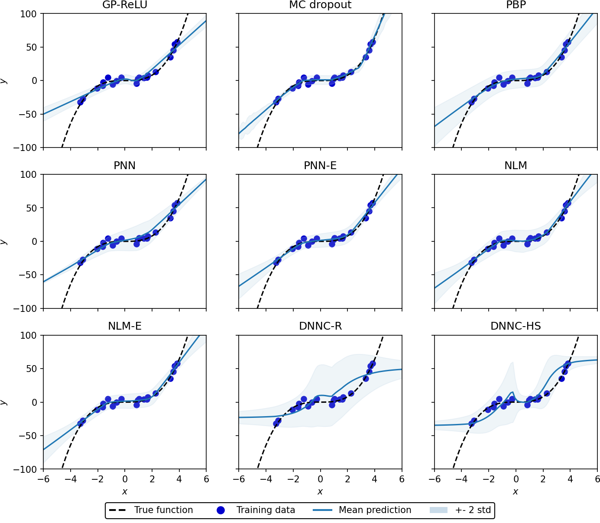
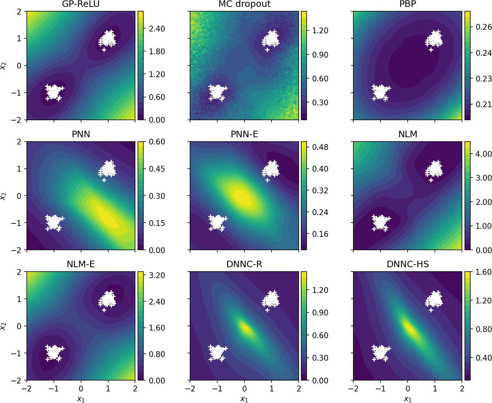

[Toy](toy)
--------

| *Toy 1D* | *Toy 2D* |
| :--: | :--: |
|  |  |

[UCI](uci)
--------
### (Predictive) Performance

<table>
<tr><th> Random Splits </th><th> Gap Splits  </th><th> Tail Splits </th></tr>  

<tr><td>

train.csv | test.csv
--- | ---
[boston](uci/random/boston_train.csv) | [boston](uci/random/boston_test.csv)
[concrete](uci/random/concrete_train.csv) | [concrete](uci/random/concrete_test.csv)
[energy](uci/random/energy_train.csv) | [energy](uci/random/energy_test.csv)
[kin8nm](uci/random/kin8nm_train.csv) | [kin8nm](uci/random/kin8nm_test.csv)
[powerplant](uci/random/powerplant_train.csv) | [powerplant](uci/random/powerplant_test.csv)
[wine](uci/random/wine_train.csv) | [wine](uci/random/wine_test.csv)
[yacht](uci/random/yacht_train.csv) | [yacht](uci/random/yacht_test.csv)

</td><td>

train.csv | test.csv
--- | ---
[boston](uci/gap/boston_train.csv) | [boston](uci/gap/boston_test.csv)
[concrete](uci/gap/concrete_train.csv) | [concrete](uci/gap/concrete_test.csv)
[energy](uci/gap/energy_train.csv) | [energy](uci/gap/energy_test.csv)
[kin8nm](uci/gap/kin8nm_train.csv) | [kin8nm](uci/gap/kin8nm_test.csv)
[powerplant](uci/gap/powerplant_train.csv) | [powerplant](uci/gap/powerplant_test.csv)
[wine](uci/gap/wine_train.csv) | [wine](uci/gap/wine_test.csv)
[yacht](uci/gap/yacht_train.csv) | [yacht](uci/gap/yacht_test.csv)

</td><td>

train.csv | test.csv
--- | ---
[boston](uci/tail/boston_train.csv) | [boston](uci/tail/boston_test.csv)
[concrete](uci/tail/concrete_train.csv) | [concrete](uci/tail/concrete_test.csv)
[energy](uci/tail/energy_train.csv) | [energy](uci/tail/energy_test.csv)
[kin8nm](uci/tail/kin8nm_train.csv) | [kin8nm](uci/tail/kin8nm_test.csv)
[powerplant](uci/tail/powerplant_train.csv) | [powerplant](uci/tail/powerplant_test.csv)
[wine](uci/tail/wine_train.csv) | [wine](uci/tail/wine_test.csv)
[yacht](uci/tail/yacht_train.csv) | [yacht](uci/tail/yacht_test.csv)

</td></tr> 
</table>

### Calibration

| *Marginal Calibration* | *Probabilistic Calibration* |
| :--: | :--: |
|  |  |
