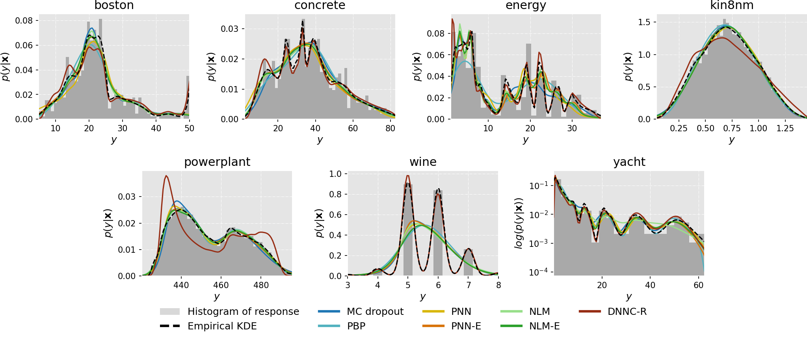

(Predictive) Performance
--------

<table>
<tr><th> Random Split </th><th> Gap Splits  </th><th> Tail Splits </th></tr>  

<tr><td>

train.csv | test.csv
--- | ---
[boston](random/boston_train.csv) | [boston](random/boston_test.csv)
[concrete](random/concrete_train.csv) | [concrete](random/concrete_test.csv)
[energy](random/energy_train.csv) | [energy](random/energy_test.csv)
[kin8nm](random/kin8nm_train.csv) | [kin8nm](random/kin8nm_test.csv)
[powerplant](random/powerplant_train.csv) | [powerplant](random/powerplant_test.csv)
[wine](random/wine_train.csv) | [wine](random/wine_test.csv)
[yacht](random/yacht_train.csv) | [yacht](random/yacht_test.csv)

</td><td>

train.csv | test.csv
--- | ---
[boston](gap/boston_train.csv) | [boston](gap/boston_test.csv)
[concrete](gap/concrete_train.csv) | [concrete](gap/concrete_test.csv)
[energy](gap/energy_train.csv) | [energy](gap/energy_test.csv)
[kin8nm](gap/kin8nm_train.csv) | [kin8nm](gap/kin8nm_test.csv)
[powerplant](gap/powerplant_train.csv) | [powerplant](gap/powerplant_test.csv)
[wine](gap/wine_train.csv) | [wine](gap/wine_test.csv)
[yacht](gap/yacht_train.csv) | [yacht](gap/yacht_test.csv)

</td><td>

train.csv | test.csv
--- | ---
[boston](tail/boston_train.csv) | [boston](tail/boston_test.csv)
[concrete](tail/concrete_train.csv) | [concrete](tail/concrete_test.csv)
[energy](tail/energy_train.csv) | [energy](tail/energy_test.csv)
[kin8nm](tail/kin8nm_train.csv) | [kin8nm](tail/kin8nm_test.csv)
[powerplant](tail/powerplant_train.csv) | [powerplant](tail/powerplant_test.csv)
[wine](tail/wine_train.csv) | [wine](tail/wine_test.csv)
[yacht](tail/yacht_train.csv) | [yacht](tail/yacht_test.csv)

</td></tr> 
</table>

Calibration
------
| *Marginal Calibration* |
|:--:|
|  |
  
| *Probabilistic Calibration* |
|:--:|
|  |

