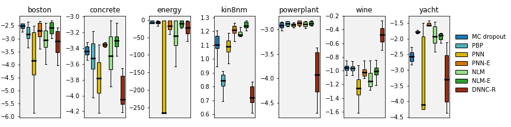
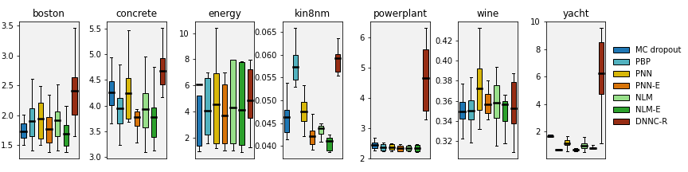
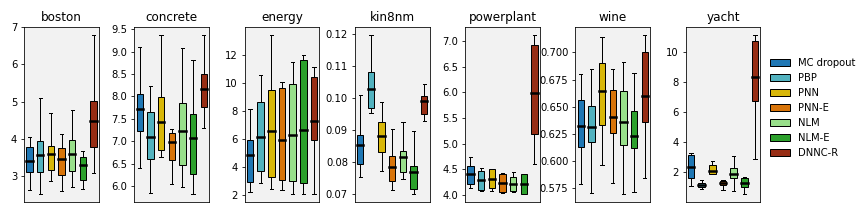
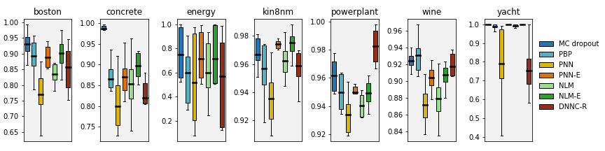

See *make_gap_splits* from [here](../../../nnuncert/utils/traintest.py) on how we created the gap splits.

Predictive performance
------
| *Logarithmic Score (LogS)* |
|:--:|
|  |

| *Continuous Ranked Probability Score (CRPS)* |
|:--:|
|  |

| *Root Mean Square Error (RMSE)* |
|:--:|
|  |

| *Prediction Interval Coverage Probability (PICP)* |
|:--:|
|  |

Results as .csv files
-----
Dataset | train.csv | test.csv
--- | --- | ---
boston | [boston_train.csv](boston_train.csv) | [boston_test.csv](boston_test.csv)
concrete | [concrete_train.csv](concrete_train.csv) | [concrete_test.csv](concrete_test.csv)
energy | [energy_train.csv](energy_train.csv) | [energy_test.csv](energy_test.csv)
kin8nm | [kin8nm_train.csv](kin8nm_train.csv) | [kin8nm_test.csv](kin8nm_test.csv)
powerplant | [powerplant_train.csv](powerplant_train.csv) | [powerplant_test.csv](powerplant_test.csv)
wine | [wine_train.csv](wine_train.csv) | [wine_test.csv](wine_test.csv)
yacht | [yacht_train.csv](yacht_train.csv) | [yacht_test.csv](yacht_test.csv)
